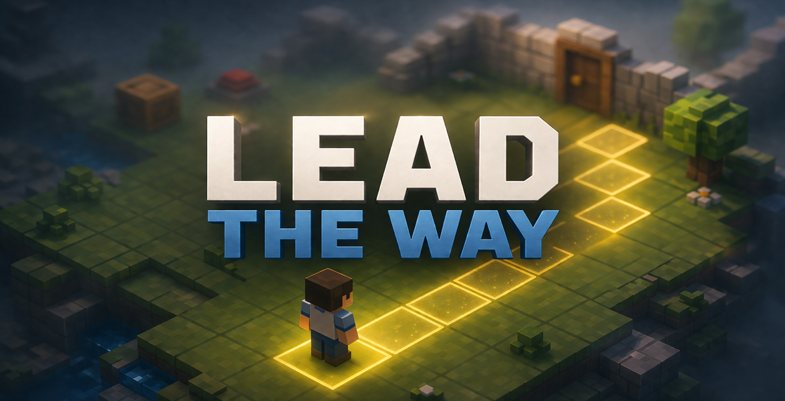
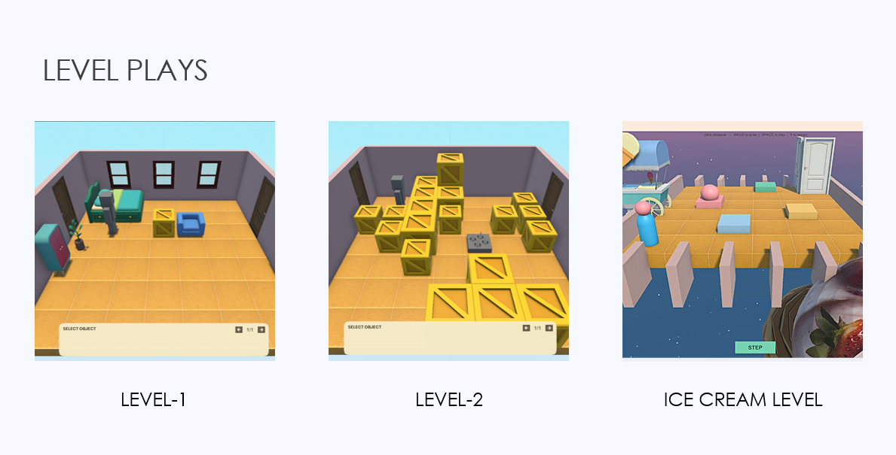

# Project-Lead-The-Way
Game Development, version control, system updates, and utilities.




> *"True control comes from shaping the environment."*
A 2D isometric puzzle game built in Unity where you never directly control the hero — you control the world around them.


---

## Problem It Solves

Most puzzle-platformers hand the player direct control of a character and ask them to react in real time — the challenge lives in execution and reflexes. **Lead the Way** removes that crutch entirely. The player can't move the protagonist at all; the character walks on their own, governed by simple AI. The only lever the player has is the environment itself: crates, switches, hazards, and interactive props that can be selected, repositioned, or triggered.

This design constraint solves a specific problem in puzzle game design: it forces **planning over twitch reaction**. Every challenge becomes a "think two steps ahead" problem instead of an "act fast enough" problem, creating a calmer, more cerebral puzzle experience that's distinct from typical action-puzzle hybrids. The goal in every level is simple — guide the autonomous character safely to the exit by reshaping the path in front of them.

## Features

- **Indirect control gameplay**: select and manipulate objects (boxes, switches, hazards, doors) instead of the character
- **Autonomous character AI**: the protagonist moves and reacts to the environment on its own
- **Isometric voxel art style**: clean, minimalist, brightly lit block-based world
- **Object selection & switching system**: cycle between controllable environment objects mid-level
- **Level management**: load, save, and reset levels with a move counter and win/lose conditions
- **Audio feedback**: distinct sounds for movement, button presses, object moves, and level completion

## Tech Stack

| Category | Tools / Assets |
|---|---|
| Engine | Unity |
| Editor / IDE | Visual Studio Code |
| Graphics | Isometric voxel-style environment tiles, interactive objects, character & enemy models, environment props, UI elements |
| Audio | Movement, button press, object move, and level-complete sound effects |
| Core Systems | Character AI (automatic movement & simple behavior), object interaction & control system, object selection & switching system, level management (load/save/reset), collision handling, UI system (move counter, menus, prompts), win/lose conditions |

## Installation

### Prerequisites

- [Unity Hub](https://unity.com/download) with Unity (2022 LTS or later recommended)
- [Visual Studio Code](https://code.visualstudio.com/) (or your preferred C# IDE)
- Git

### Setup

```bash
# Clone the repository
git clone https://github.com/<your-org>/lead-the-way.git
cd lead-the-way
```

1. Open **Unity Hub** → **Add project from disk** → select the cloned `lead-the-way` folder.
2. Open the project with the Unity version specified in `ProjectSettings/ProjectVersion.txt`.
3. Once Unity finishes importing assets, open the main scene from `Assets/Scenes/`.
4. Press **Play** in the Unity Editor to run the game.

### Building

In Unity, go to **File → Build Settings**, select your target platform, add the scenes you want included, and click **Build**.

## Project Timeline

Development is iterative, prioritizing core mechanics first, then content, polish, and final presentation.

| Week | Milestone |
|---|---|
| 5 | Finalize UI layout, define game feel, plan menus/HUD, lock direction |
| 6 | Build core mechanics - character AI movement, object interaction & switching, basic level structure |
| 7 | Build out multiple levels, introduce new mechanics gradually, balance difficulty, playtest |
| 8 | Final polish - visuals, animations, sound, feedback tuning, bug fixing |
| 9 | Final group presentation - gameplay demo, recorded footage, presentation practice |

## Team / Division of Labor

Work is split across three categories:

1. **Core Systems**: gameplay logic, AI, interaction systems
2. **Game Design**: level design, mechanics, pacing, balancing
3. **UI / Art**: visual style, interface, and asset creation

## Contributing

This is a student/team project. If you'd like to contribute, please open an issue or submit a pull request describing the change.

## License

Apache MIT License
